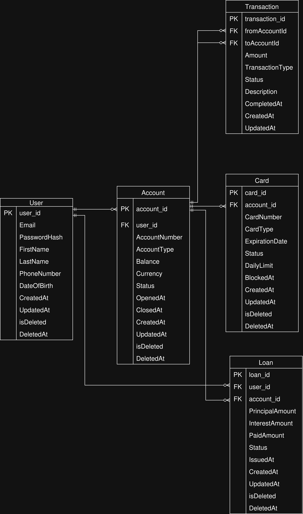

# Database Schema Documentation

## Entity-Relationship Diagram (ERD)

## Table Descriptions

### Table: `User`

**Purpose:** Stores personal information and authentication credentials for bank customers.

| Column | Type | Constraints | Description |
| :--- | :--- | :--- | :--- |
| `user_id` | UUID | PRIMARY KEY | Unique identifier for the user |
| `Email` | VARCHAR(100) | UNIQUE, NOT NULL | User's email address |
| `PasswordHash` | TEXT | NOT NULL | Securely hashed password |
| `FirstName` | VARCHAR(50) | NOT NULL | Customer's first name |
| `LastName` | VARCHAR(50) | NOT NULL | Customer's last name |
| `PhoneNumber` | VARCHAR(50) | UNIQUE | Contact phone number |
| `DateOfBirth` | TIMESTAMP | NOT NULL | Customer's birth date (No Timezone) |
| `CreatedAt` | TIMESTAMP | DEFAULT NOW() | Record creation timestamp (No Timezone) |
| `UpdatedAt` | TIMESTAMP | DEFAULT NOW() | Record update timestamp (With Timezone) |
| `isDeleted` | BOOLEAN | DEFAULT FALSE | Soft delete flag |
| `DeletedAt` | TIMESTAMP | NULL | Timestamp when the user was soft-deleted (No Timezone) |

**Relationships:**
* **One-to-Many** with `Account` (A user can hold multiple accounts).
* **One-to-Many** with `Loan` (A user can have multiple active loans).

---

### Table: `Account`

**Purpose:** Manages the financial accounts (e.g., savings, checking) held by users.

| Column | Type | Constraints | Description |
| :--- | :--- | :--- | :--- |
| `account_id` | UUID | PRIMARY KEY | Unique identifier for the account |
| `user_id` | UUID | FOREIGN KEY | Reference to the account holder (`User`) |
| `AccountNumber` | VARCHAR(30) | UNIQUE, NOT NULL | Public-facing account number |
| `AccountType` | TEXT | NOT NULL | Type of account (e.g., Checking, Savings) |
| `Balance` | NUMERIC(18,2) | DEFAULT 0.00 | Current available funds |
| `Currency` | VARCHAR(3) | NOT NULL | Currency code (e.g., USD, EUR) |
| `Status` | TEXT | DEFAULT 'ACTIVE' | Account state (Active, Frozen, Closed) |
| `OpenedAt` | TIMESTAMP | DEFAULT NOW() | Date the account was opened (No Timezone) |
| `ClosedAt` | TIMESTAMP | NULL | Date the account was closed (No Timezone) |
| `CreatedAt` | TIMESTAMP | DEFAULT NOW() | Record creation timestamp (No Timezone) |
| `UpdatedAt` | TIMESTAMP | DEFAULT NOW() | Record update timestamp (With Timezone) |
| `isDeleted` | BOOLEAN | DEFAULT FALSE | Soft delete flag |
| `DeletedAt` | TIMESTAMP | NULL | Timestamp when the account was deleted (No Timezone) |

**Relationships:**
* **Many-to-One** with `User` (Belongs to one user).
* **One-to-Many** with `Card` (Multiple cards can be linked to one account).
* **One-to-Many** with `Transaction` (Used as source or destination).
* **One-to-Many** with `Loan` (Loans are disbursed to specific accounts).

---

### Table: `Transaction`

**Purpose:** Records the history of financial movements between accounts.

| Column | Type | Constraints | Description |
| :--- | :--- | :--- | :--- |
| `transaction_id` | UUID | PRIMARY KEY | Unique identifier for the transaction |
| `fromAccountId` | UUID | FOREIGN KEY | Reference to the sender's `Account` |
| `toAccountId` | UUID | FOREIGN KEY | Reference to the receiver's `Account` |
| `Amount` | NUMERIC(18,2) | NOT NULL | The monetary value transferred |
| `TransactionType`| TEXT | NOT NULL | Type (Transfer, Payment, Deposit) |
| `Status` | TEXT | DEFAULT 'PENDING'| State (Pending, Completed, Failed) |
| `Description` | VARCHAR(256) | NULL | Note or memo regarding the transaction |
| `CompletedAt` | TIMESTAMP | NULL | When the transaction was finalized (No Timezone) |
| `CreatedAt` | TIMESTAMP | DEFAULT NOW() | When the transaction was initiated (No Timezone) |
| `UpdatedAt` | TIMESTAMP | DEFAULT NOW() | Last update to transaction status (With Timezone) |

**Relationships:**
* **Many-to-One** with `Account` (Links twice: once for sender, once for receiver).

---

### Table: `Card`

**Purpose:** Manages physical or virtual cards linked to specific bank accounts.

| Column | Type | Constraints | Description |
| :--- | :--- | :--- | :--- |
| `card_id` | UUID | PRIMARY KEY | Unique identifier for the card entity |
| `account_id` | UUID | FOREIGN KEY | Reference to the underlying `Account` |
| `CardNumber` | VARCHAR(16) | UNIQUE, NOT NULL | The 16-digit card number (PAN) |
| `CardType` | TEXT | NOT NULL | Type (Debit, Credit, Virtual) |
| `ExpirationDate` | TIMESTAMP | NOT NULL | Date when the card expires (No Timezone) |
| `Status` | TEXT | DEFAULT 'ACTIVE' | State (Active, Blocked, Expired) |
| `DailyLimit` | NUMERIC(18,2) | NULL | Spending limit per day |
| `BlockedAt` | TIMESTAMP | NULL | Date if/when the card was blocked (No Timezone) |
| `CreatedAt` | TIMESTAMP | DEFAULT NOW() | Card issuance record creation (No Timezone) |
| `UpdatedAt` | TIMESTAMP | DEFAULT NOW() | Last update timestamp (With Timezone) |
| `isDeleted` | BOOLEAN | DEFAULT FALSE | Soft delete flag |
| `DeletedAt` | TIMESTAMP | NULL | Timestamp when the card was deleted (No Timezone) |

**Relationships:**
* **Many-to-One** with `Account` (Draws funds from a specific account).

---

### Table: `Loan`

**Purpose:** Tracks money lent to users, including principal, interest, and repayment status.

| Column | Type | Constraints | Description |
| :--- | :--- | :--- | :--- |
| `loan_id` | UUID | PRIMARY KEY | Unique identifier for the loan |
| `user_id` | UUID | FOREIGN KEY | Reference to the borrower (`User`) |
| `account_id` | UUID | FOREIGN KEY | Account where funds were deposited |
| `PrincipalAmount`| NUMERIC(18,2) | NOT NULL | The original amount borrowed |
| `InterestAmount` | NUMERIC(18,2) | NOT NULL | The interest calculated on the loan |
| `PaidAmount` | NUMERIC(18,2) | DEFAULT 0.00 | Total amount repaid so far |
| `Status` | TEXT | DEFAULT 'ACTIVE' | State (Active, Paid, Defaulted) |
| `IssuedAt` | TIMESTAMP | DEFAULT NOW() | Date the loan was approved/issued (No Timezone) |
| `CreatedAt` | TIMESTAMP | DEFAULT NOW() | Record creation timestamp (No Timezone) |
| `UpdatedAt` | TIMESTAMP | DEFAULT NOW() | Last update timestamp (With Timezone) |
| `isDeleted` | BOOLEAN | DEFAULT FALSE | Soft delete flag |
| `DeletedAt` | TIMESTAMP | NULL | Timestamp when the loan was deleted (No Timezone) |

**Relationships:**
* **Many-to-One** with `User` (The borrower).
* **Many-to-One** with `Account` (The account associated with the funds).
